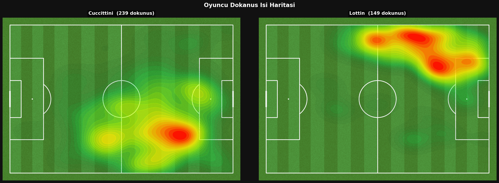
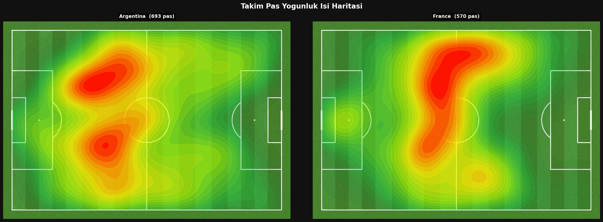
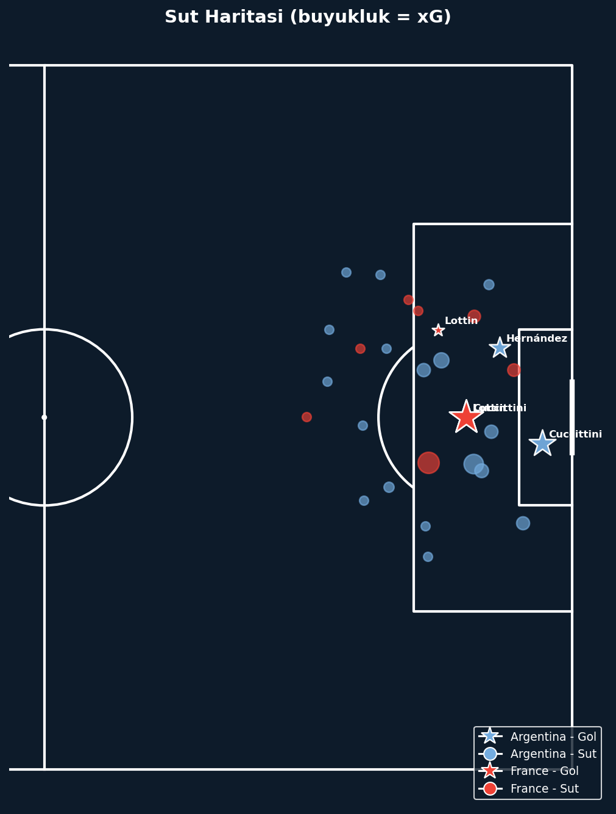
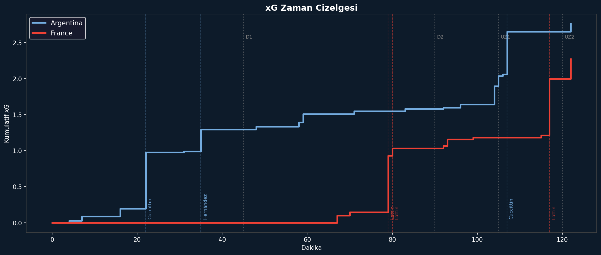

# 2022 FIFA World Cup Final — Argentina vs France

Event-level match analysis of the 2022 FIFA World Cup Final using StatsBomb open data.

## Data Source

All data is fetched at runtime from the [StatsBomb Open Data](https://github.com/statsbomb/open-data) repository via the `statsbombpy` Python library. No local data files are required.

- Competition: FIFA World Cup 2022
- Match: Argentina 3–3 France (AET) — Argentina won 4–2 on penalties
- Match ID resolved dynamically via `sb.matches(competition_id=43, season_id=106)`
- Total events in the dataset: ~4,400 across 94 columns

## Requirements

```
pip install statsbombpy mplsoccer matplotlib numpy pandas scipy pillow
```

Python 3.8 or higher is required.

## Notebooks

Run in order:

| Notebook | Description |
|----------|-------------|
| `01_data_pipeline.ipynb` | Fetches data from StatsBomb, parses coordinates, saves processed DataFrame to `cache/` |
| `02_visualizations.ipynb` | Loads from cache and renders all 14 visualizations — output PNGs saved to `figures/` |

`01_data_pipeline.ipynb` caches every API response to `cache/*.json` and saves the processed events as `cache/events_processed.pkl`. Subsequent runs skip the network entirely.

## Visualizations

### Player Touch Heatmap

Gaussian KDE over all event locations per player, rendered on a grass pitch background.



---

### Team Pass Density Heatmap

Gaussian KDE on pass origin coordinates for each team.



---

### Shot Map

Scatter on half-pitch, marker size scaled by StatsBomb xG value. Stars mark goals.



---

### Pass Network

Average player positions connected by edges weighted by pass-pair frequency (first half only).


---

### xG Timeline

Cumulative StatsBomb xG step chart with goal markers and half-time lines.



---

### Match Momentum

3-minute rolling action count (line) and per-minute momentum differential (bar).


---

### Counter-Press Heatmap

Gaussian KDE on pressure events occurring within 5 seconds of an opponent ball loss.


---

### Goal Buildup Map

Last 8 events before each goal shown as an arrow chain, one subplot per goal.


---

## Full Visualization List

| # | Plot | Method |
|---|------|--------|
| 1 | Player Touch Heatmap (Messi, Mbappe) | Gaussian KDE over all event locations |
| 2 | Team Pass Density Heatmap | Gaussian KDE on pass origin coordinates |
| 3 | Shot Map | Scatter on half-pitch, size scaled by xG |
| 4 | Pass Network (1st half) | Average player positions + pass-pair frequency edges |
| 5 | xG Timeline | Cumulative StatsBomb xG step chart with goal markers |
| 6 | Defensive Action Map | Scatter by event type (Pressure, Block, Interception, Ball Recovery) |
| 7 | Progressive Pass Map | Arrows for passes gaining ≥10m toward goal |
| 8 | Player Radar Chart | 7-metric polar comparison (Messi vs Mbappe, Di Maria vs Griezmann) |
| 9 | Match Momentum | 3-minute rolling action count, dual subplot (line + bar differential) |
| 10 | Zone Control Map | 6-zone pitch split, action-count ratio colored by dominant team |
| 11 | Dribble Map | Successful vs failed dribbles, success rate labelled |
| 12 | Pass Direction Rose | Polar histogram (24 bins) of pass angles |
| 13 | Counter-Press Heatmap | Gaussian KDE on pressures within 5s of opponent ball loss |
| 14 | Goal Buildup Map | Last 8 events before each goal, arrow-chain per subplot |

## Coordinate System

StatsBomb events use a 120 × 80 unit pitch:
- x: 0 (own goal line) to 120 (opponent goal line)
- y: 0 (left touchline) to 80 (right touchline)

`mplsoccer` is used for all pitch drawings with `pitch_type='statsbomb'`.

## Project Structure

```
Match_Analysis2/
├── 01_data_pipeline.ipynb
├── 02_visualizations.ipynb
├── README.md
├── soccer-heatmap-creator-*.webp   # pitch background image
├── cache/                          # API responses + processed DataFrame
│   ├── competitions.json
│   ├── matches_43_106.json
│   ├── events_3869685.json
│   ├── events_processed.pkl
│   └── meta.json
└── figures/                        # output PNGs (14 files)
    ├── gorsel_01_oyuncu_isi.png
    ├── gorsel_02_pas_isi.png
    └── ...
```
