# UEFA Euro 2020 Final — Italy vs England

**Italy 1–1 England (AET) · Italy won 3–2 on penalties**
Wembley Stadium, London · 11 July 2021

## Data Source

| Field | Value |
|---|---|
| Competition | UEFA Euro 2020 |
| competition_id | 55 |
| season_id | 43 |
| match_id | **3795506** |
| Provider | StatsBomb Open Data |
| 360 data | **Available** — 58,906 freeze-frame rows |

### Goals (regulation + extra time)

| Minute | Player | Team |
|---|---|---|
| 2' | Luke Shaw | England |
| 67' | Leonardo Bonucci | Italy |

Italy won 3–2 on penalties (period 5; not included in event-level analyses).

### xG Totals (regulation + extra time)

| Team | xG |
|---|---|
| Italy | **2.082** |
| England | **0.426** |

---

## Requirements

```bash
pip install statsbombpy mplsoccer matplotlib numpy pandas scipy
```

Python 3.9+ required.

---

## Notebooks

| Notebook | Purpose |
|---|---|
| `01_data_pipeline.ipynb` | Fetch events (all 5 periods), 360 frames, lineups · clean · cache to `cache/` |
| `02_visualizations.ipynb` | Load from cache · produce 11 standard figures + freeze-frame · print summary |

The `_run_viz.py` script produces the full 27-figure set (English + Turkish names) and can be run standalone.

---

## Visualizations

### Shot Map

All shots from regulation + extra time (periods 1–4). Bubble size proportional to xG. Stars mark goals.

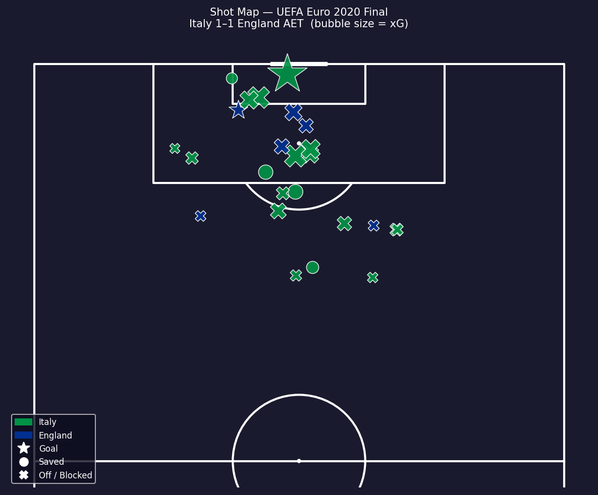

---

### Italy Pass Network

Average player positions (nodes) and completed passing connections (edges) during regulation (periods 1–2). Node size = total actions; edge width = pass pair frequency.

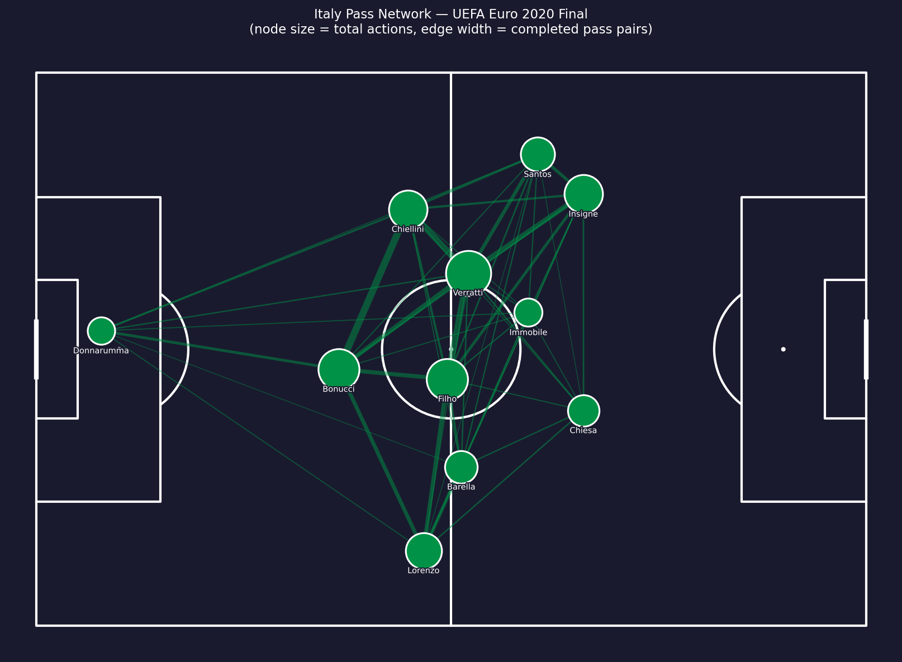

---

### England Pass Network

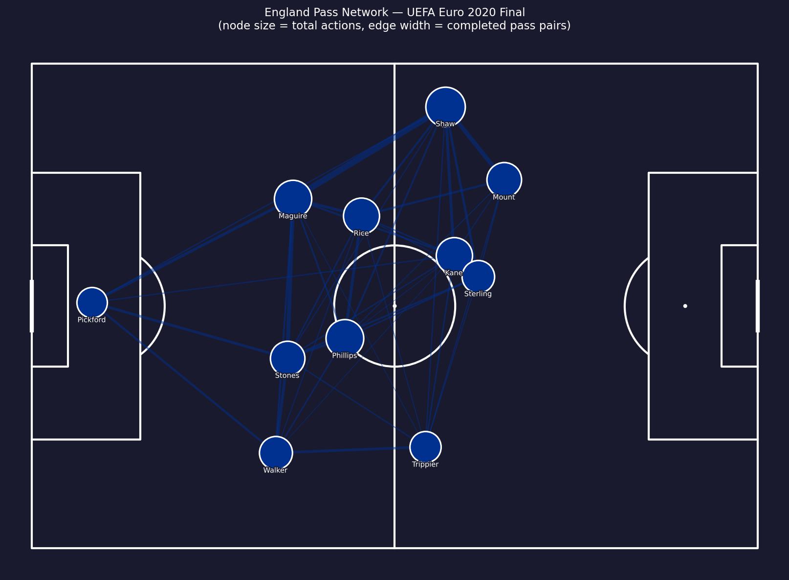

---

### Italy Touch Heatmap

Gaussian KDE of all Italy passes + carries across regulation and extra time.

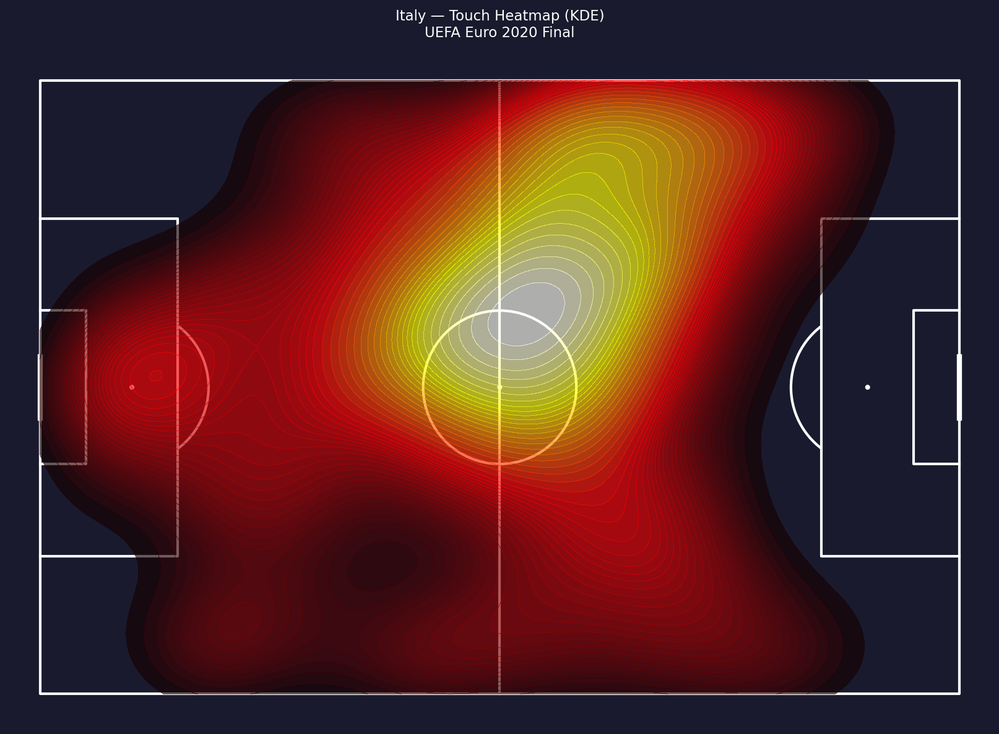

---

### England Touch Heatmap

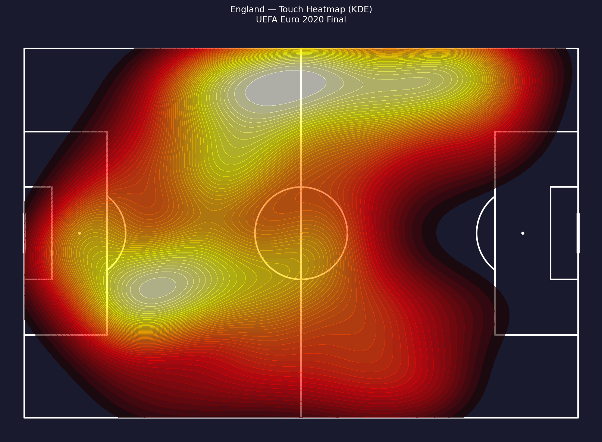

---

### Defensive Actions

Pressures (circles), blocks (squares), and interceptions (triangles) for both teams.

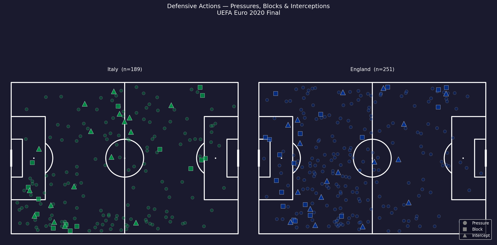

---

### xG Timeline (incl. Extra Time)

Cumulative xG step chart across all 120 minutes. Dashed vertical lines mark goals; dotted lines mark HT, FT/ET and ET half-time.

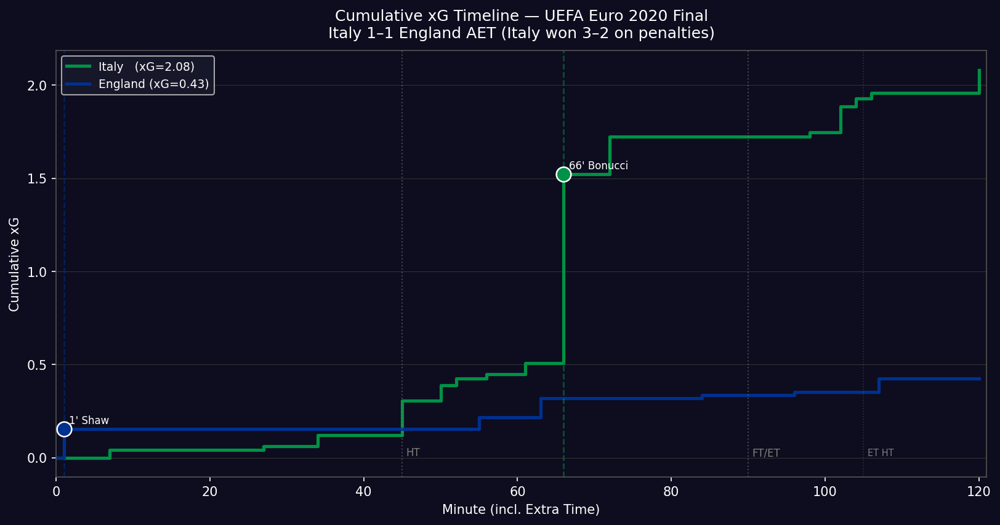

---

### Match Momentum (120 min)

Upper panel: 5-minute rolling event count per team. Lower panel: Italy–England differential (green = Italy dominant, blue = England dominant).

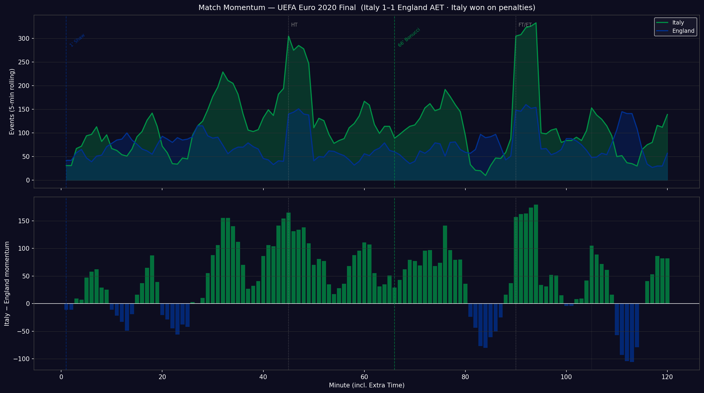

---

### Italy Key Players Radar

Bonucci (goal scorer), Verratti, Jorginho — selected by goal involvement and event volume. Metrics normalised to each player's own maximum.

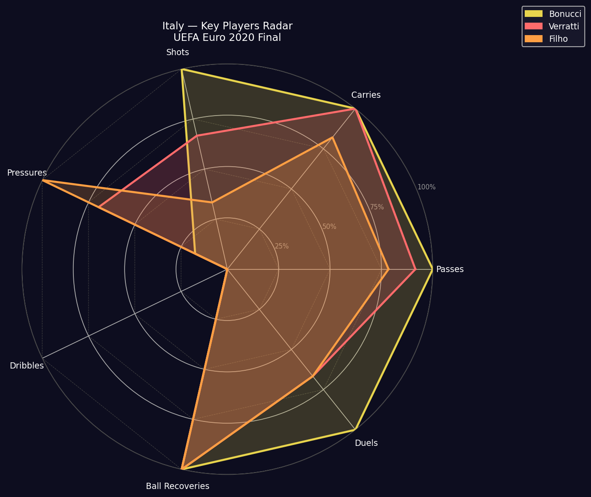

---

### England Key Players Radar

Shaw (goal scorer), Kalvin Phillips, Harry Kane.

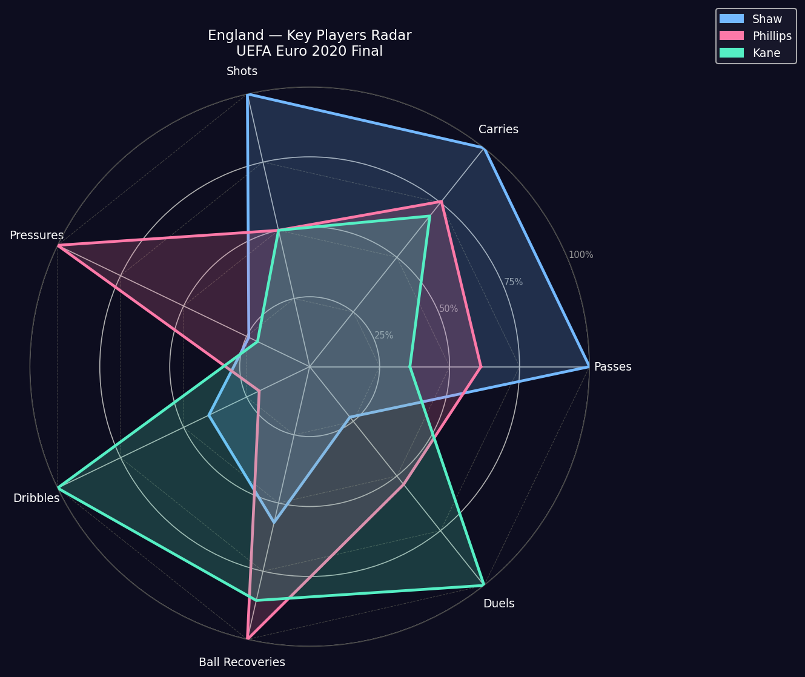

---

### Team Statistics Comparison

Shots, shots on target, xG, passes, pass accuracy, pressures — all from regulation + extra time.

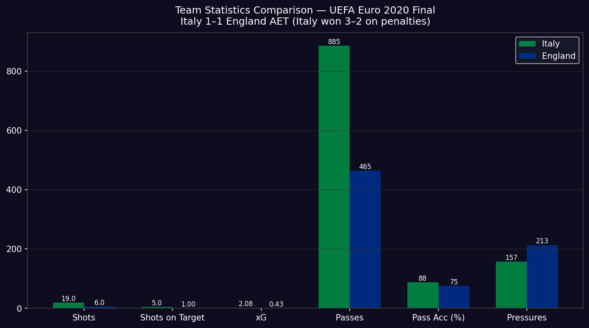

---

### Shot Freeze-Frame (360 data highlight)

Player positions at the exact moment of each goal — Luke Shaw (2') and Leonardo Bonucci (67'). Data from StatsBomb 360 tracking (58,906 rows available for this match).

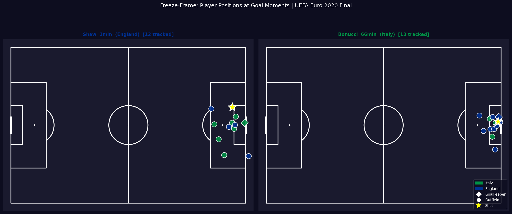

---

### Pressure Map

KDE heatmap of where each team applied pressure across the pitch.

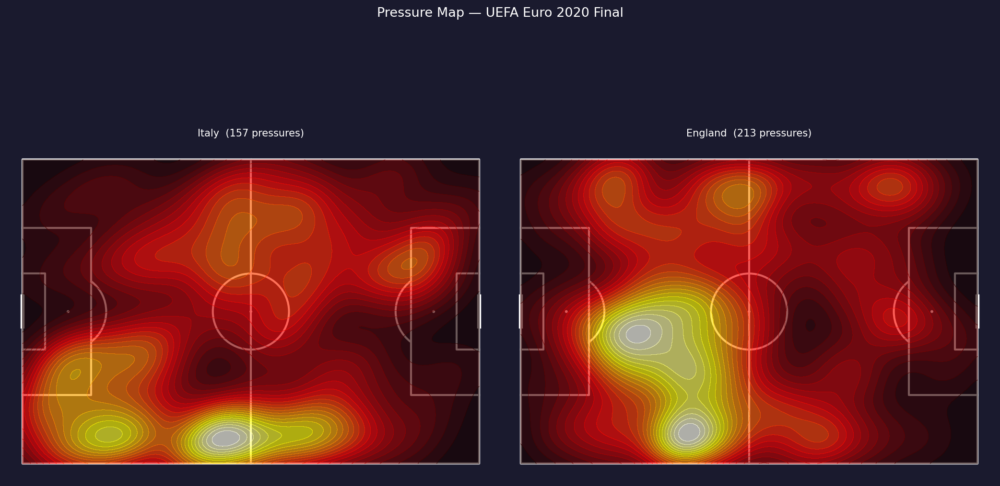

---

## Full Visualization List

| File | Type | Method |
|---|---|---|
| shot_map.png | Spatial | VerticalPitch scatter, xG bubble sizing |
| pass_network_italy.png | Spatial | Average positions + edge weights |
| pass_network_england.png | Spatial | Average positions + edge weights |
| heatmap_italy.png | Spatial | Gaussian KDE (mplsoccer kdeplot) |
| heatmap_england.png | Spatial | Gaussian KDE (mplsoccer kdeplot) |
| defensive_actions.png | Spatial | Scatter by event type |
| xg_timeline.png | Temporal | Cumulative step chart, 120 min |
| momentum.png | Temporal | Rolling event count + differential bar |
| radar_italy_key_players.png | Comparison | Polar chart, normalised per metric |
| radar_england_key_players.png | Comparison | Polar chart, normalised per metric |
| team_stats_comparison.png | Comparison | Grouped bar chart |
| shot_freeze_frame.png | Spatial/360 | 360 freeze-frame player positions |
| pressure_map.png | Spatial | Gaussian KDE on pressure events |
| gorsel_01_oyuncu_isi.png | Spatial | Player touch KDE |
| gorsel_02_pas_isi.png | Spatial | Team pass density KDE |
| gorsel_03_sut.png | Spatial | Shot map (half pitch) |
| gorsel_04_pas_agi.png | Spatial | Pass network (1st half only) |
| gorsel_05_xg.png | Temporal | xG timeline (Turkish labels) |
| gorsel_06_savunma.png | Spatial | Defensive action map |
| gorsel_07_ilerletici_pas.png | Spatial | Progressive passes (≥10m gain) |
| gorsel_08_radar.png | Comparison | Verratti vs Rice / Bonucci vs Mount |
| gorsel_09_momentum.png | Temporal | Momentum (120 min, Turkish labels) |
| gorsel_10_bolge.png | Spatial | 6-zone control map |
| gorsel_11_dribbling.png | Spatial | Dribble map (success/failure) |
| gorsel_12_pas_yonu.png | Comparison | Pass direction rose (polar histogram) |
| gorsel_13_counter_press.png | Spatial | Counter-press KDE |
| gorsel_14_gol_yapilanma.png | Spatial | Goal buildup (last 8 events) |

---

## Data Caveats

- **Extra time:** The match went to extra time. StatsBomb stores ET as periods 3 and 4 (penalty shootout = period 5). All analyses labelled "reg + ET" use periods 1–4. The penalty shootout (period 5) is excluded from all event-level figures — only the competition result (3–2) is noted.
- **360 data:** Fully available for Euro 2020. `shot_freeze_frame.png` shows true player positions from the 360 feed. `pressure_map.png` uses event x/y rather than 360 tracking.
- **xG:** Available for all 35 shots via `shot_statsbomb_xg`. The 19 Italy shots (2.08 xG) vs 6 England shots (0.43 xG) in regulation + ET reflect Italy's heavy territorial dominance after England's early goal.
- **Pass recipient:** Present in this dataset; used for pass network edge weights.
- **Jorginho full name in data:** "Jorge Luiz Frello Filho" — appears as "Filho" in short-name labels.

---

## Coordinate System

StatsBomb pitch: 120 × 80 units, origin at bottom-left of attacking direction for each team.
Period 1: home team attacks right (x increasing). All spatial plots preserve the raw coordinate frame.

---

## Project Structure

```
Italy-England2020/
├── README.md
├── 01_data_pipeline.ipynb      # fetch + cache (runs offline after first run)
├── 02_visualizations.ipynb     # 11 standard figures + freeze-frame
├── _run_viz.py                 # standalone script — all 27 figures
├── _run_pipeline.py            # standalone pipeline script
├── cache/
│   ├── competitions.json
│   ├── matches_55_43.json
│   ├── events_3795506.json
│   ├── frames_3795506.json     # 360 data (58,906 rows)
│   ├── lineups.json
│   ├── events_processed.pkl
│   └── meta.json
└── figures/                    # 27 PNG files
```
