# Football Match Analysis

Event-level tactical analysis of football matches using [StatsBomb open data](https://github.com/statsbomb/open-data). Each match lives in its own folder with a self-contained notebook and a `figures/` directory of output visualizations.

## Matches

| Folder | Match | Competition | Visualizations |
|--------|-------|-------------|----------------|
| [France-Argentina2022](./France-Argentina2022/) | Argentina 3–3 France (AET) · Argentina won 4–2 on penalties | FIFA World Cup 2022 Final | 14 |
| [France-Croatia2018](./France-Croatia2018/) | France 4–2 Croatia | FIFA World Cup 2018 Final | 24 |
| [Italy-England2020](./Italy-England2020/) | Italy 1–1 England (AET) · Italy won 3–2 on penalties · Wembley Stadium | UEFA Euro 2020 Final | 27 |
| [Spain-England2024](./Spain-England2024/) | Spain 2–1 England · Olympiastadion, Berlin | UEFA Euro 2024 Final | 25 |

---

### Italy vs England — UEFA Euro 2020 Final

**Shot Freeze-Frame (360 data — player positions at moment of each goal)**


**Shot Map (xG bubbles)**


**xG Timeline (incl. extra time)**


**Match Momentum (120 min)**


**Team Stats Comparison**


---

### Spain vs England — UEFA Euro 2024 Final

**Shot Map (xG bubbles)**

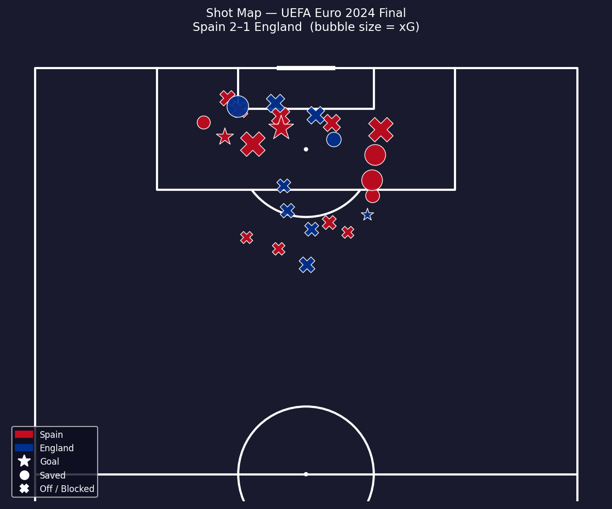

**Spain Pass Network**

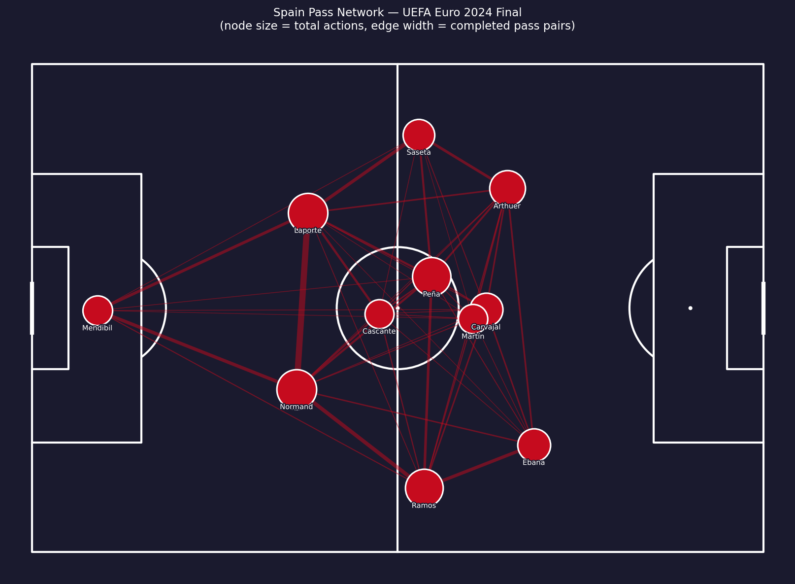

**England Pass Network**

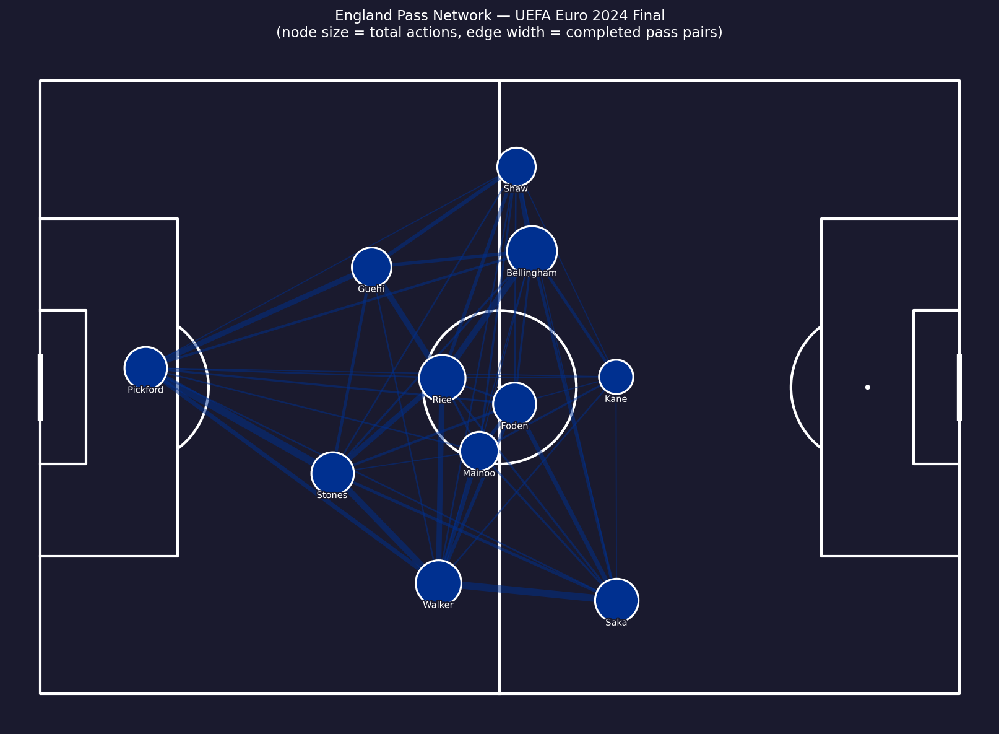

**xG Timeline**

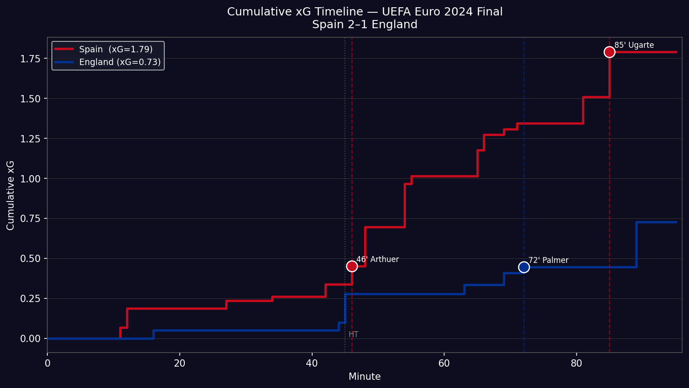

**Match Momentum**

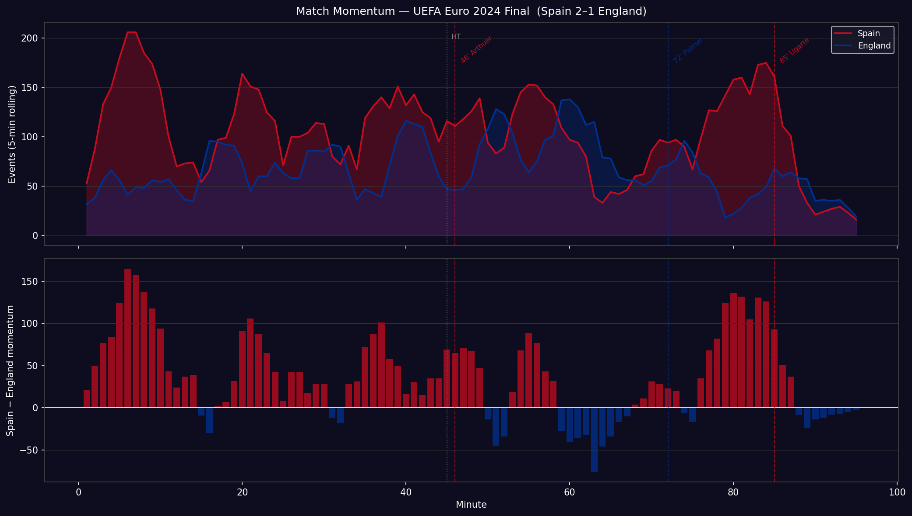

**Team Stats Comparison**

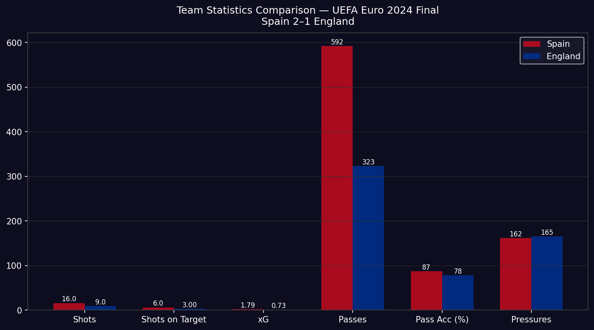

---

### Argentina vs France — 2022 World Cup Final

**Pass Networks (1st half)**

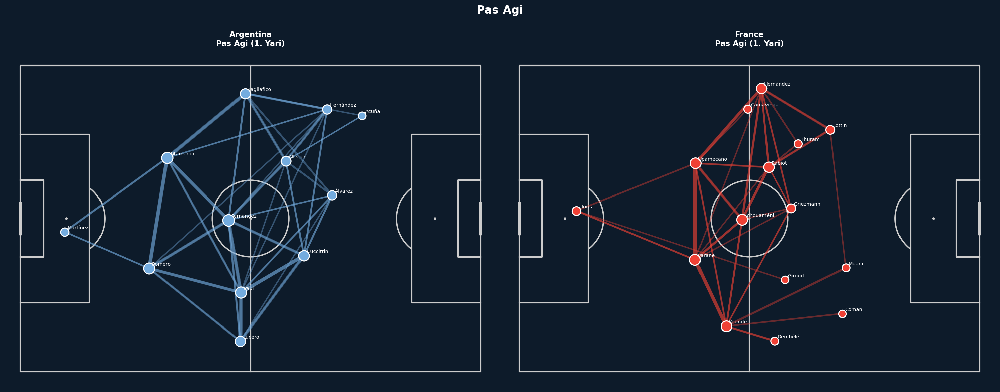

**Match Momentum**

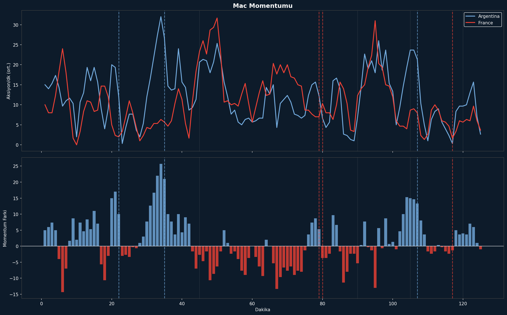

**Goal Buildup Map**

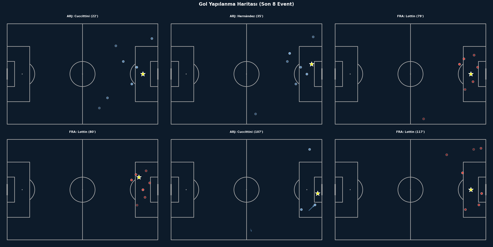

---

### France vs Croatia — 2018 World Cup Final

**Luka Modrić Touch Heatmap**

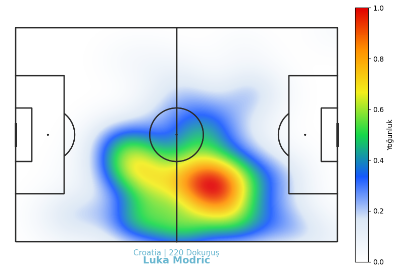

**Pass Density — Croatia**

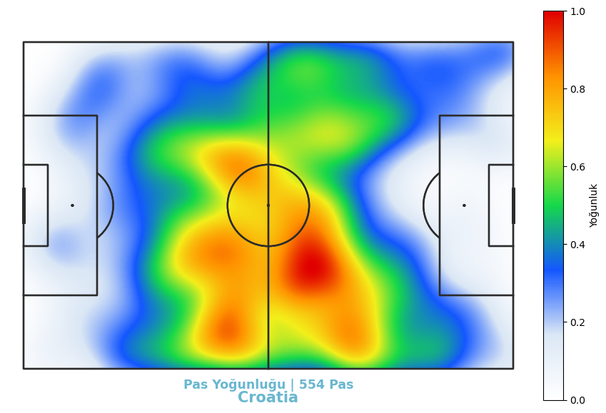

**Croatia Pass Network**

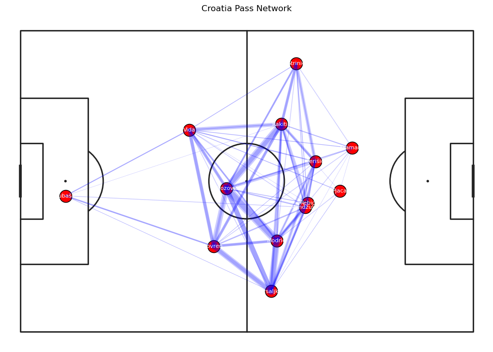

---

## What's Analyzed

Every notebook covers the same core set of analyses:

**Spatial**
- Player touch heatmaps (Gaussian KDE)
- Team pass density heatmaps
- Shot maps (marker size scaled by xG where available)
- Pass networks (average positions + edge weights)
- Progressive pass maps (passes gaining ≥10m toward goal)
- Defensive action maps (pressure, block, interception, ball recovery)
- Zone control map (6-zone pitch split)
- Dribble maps (successful vs failed)
- Counter-press heatmaps (pressures within 5s of opponent ball loss)
- Goal buildup maps (last 8 events before each goal)

**Temporal**
- xG timeline (cumulative step chart)
- Match momentum (rolling action count + differential bar)

**Comparison**
- Player radar charts (7-metric polar comparison)
- Pass direction rose (polar histogram of pass angles)

## Stack

```
statsbombpy   — StatsBomb open data API
mplsoccer     — pitch drawing and utilities
matplotlib    — all charts and figures
scipy         — Gaussian KDE for heatmaps
numpy pandas  — data wrangling
```

Install everything:

```bash
pip install statsbombpy mplsoccer matplotlib numpy pandas scipy
```

Python 3.8+ required.

## Structure

```
MatchAnalysis/
├── README.md
├── France-Argentina2022/
│   ├── 01_data_pipeline.ipynb    # fetch + cache data
│   ├── 02_visualizations.ipynb   # render all figures
│   ├── cache/                    # API responses + processed .pkl
│   └── figures/                  # 14 output PNGs
├── France-Croatia2018/
│   ├── Match_Analysis.ipynb      # single notebook: fetch + visualize
│   └── figures/                  # 24 output PNGs
├── Italy-England2020/
│   ├── 01_data_pipeline.ipynb    # fetch + cache data (incl. 360 frames)
│   ├── 02_visualizations.ipynb   # render all figures
│   ├── cache/                    # API responses + processed .pkl
│   └── figures/                  # 27 output PNGs
└── Spain-England2024/
    ├── 01_data_pipeline.ipynb    # fetch + cache data
    ├── 02_visualizations.ipynb   # render all figures
    ├── cache/                    # API responses + processed .pkl
    └── figures/                  # 25 output PNGs
```

## Data Source

All event data is pulled at runtime from [StatsBomb Open Data](https://github.com/statsbomb/open-data) via `statsbombpy`. No local data files are committed. The France-Argentina2022 notebooks cache API responses to `cache/` so subsequent runs are offline.

## License

MIT
