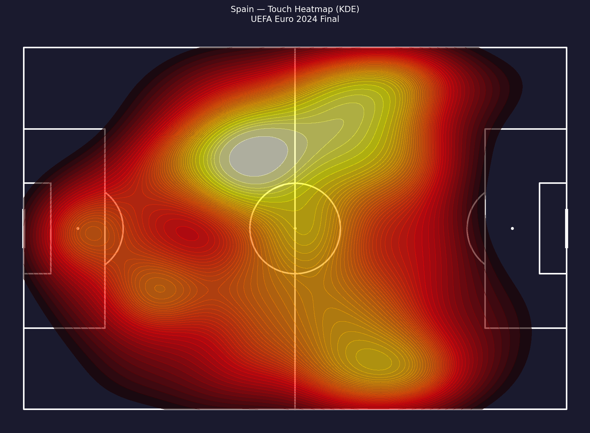
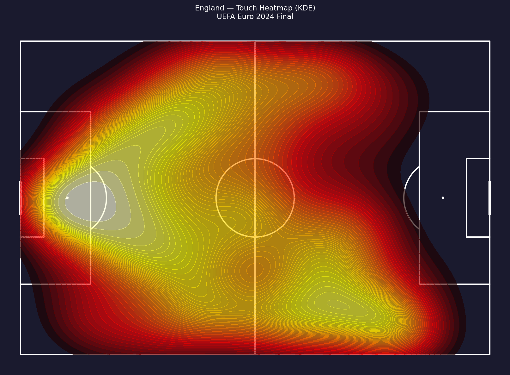
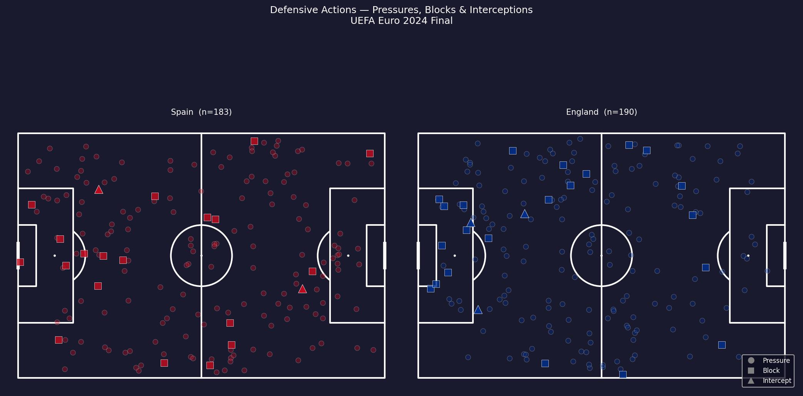
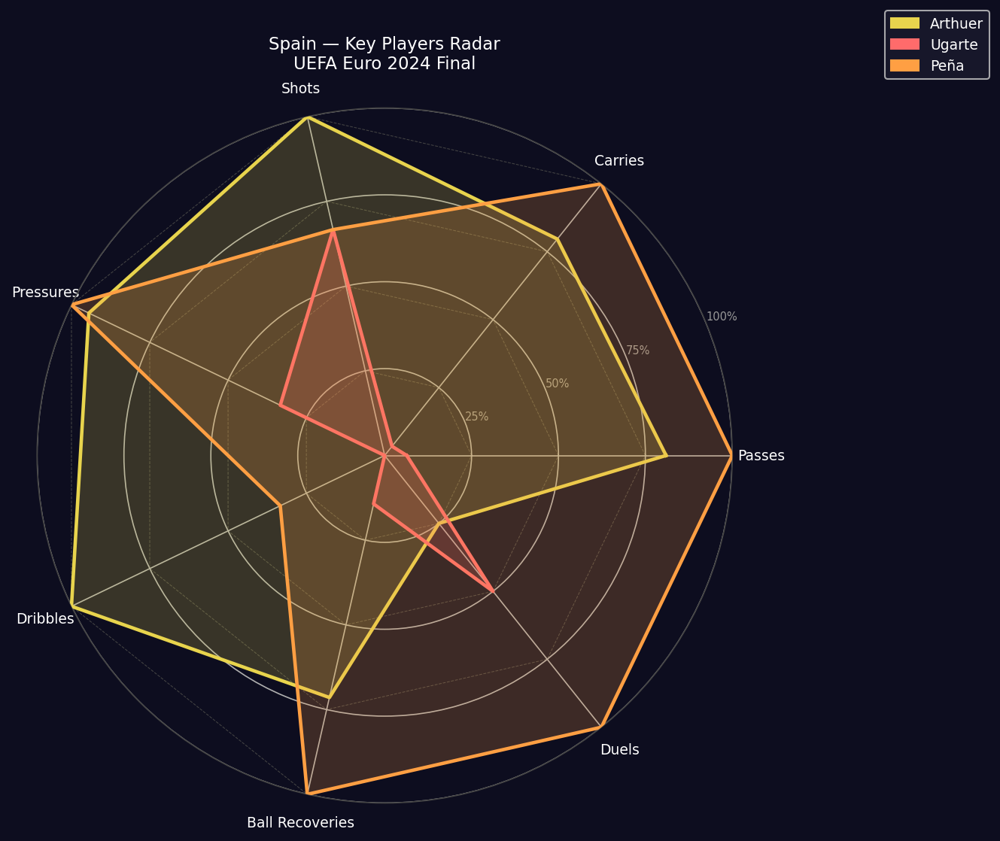
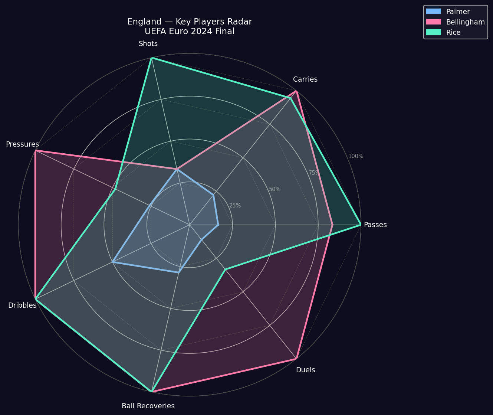

# UEFA Euro 2024 Final — Spain vs England

Event-level match analysis of the UEFA Euro 2024 Final using StatsBomb open data.

## Data Source

All data is fetched at runtime from the [StatsBomb Open Data](https://github.com/statsbomb/open-data) repository via the `statsbombpy` Python library. No local data files are required.

- Competition: UEFA Euro 2024
- Match: Spain 2–1 England — Olympiastadion, Berlin, 14 July 2024
- Match ID resolved dynamically via `sb.matches(competition_id=55, season_id=282)` → match_id `3943043`
- Goals: 46' Nico Williams (Spain), 72' Cole Palmer (England), 85' Mikel Oyarzabal (Spain)
- Spain xG: 1.79 · England xG: 0.73
- Total events in the dataset: ~3,900 across 94 columns

## Requirements

```
pip install statsbombpy mplsoccer matplotlib numpy pandas scipy pillow
```

Python 3.8 or higher is required.

## Notebooks

Run in order:

| Notebook | Description |
|----------|-------------|
| `01_data_pipeline.ipynb` | Fetches data from StatsBomb, parses coordinates, saves processed DataFrame to `cache/` |
| `02_visualizations.ipynb` | Loads from cache and renders all 25 visualizations — output PNGs saved to `figures/` |

`01_data_pipeline.ipynb` caches every API response to `cache/*.json` and saves the processed events as `cache/events_processed.pkl`. Subsequent runs skip the network entirely.

## Visualizations

### Shot Map

All shots with xG-scaled bubbles, colored by team. Stars mark goals.


---

### Pass Network — Spain

Average player positions connected by edges weighted by pass-pair frequency. Node size scales with total passes received.


---

### Pass Network — England


---

### Player Touch Heatmap — Spain

Gaussian KDE over all event locations for Spain players.



---

### Player Touch Heatmap — England

Gaussian KDE over all event locations for England players.



---

### Defensive Action Map

Tackles, interceptions, ball recoveries, and pressures for both teams on a single pitch.



---

### xG Timeline

Cumulative StatsBomb xG step chart with goal markers and half-time line.


---

### Match Momentum

5-minute rolling event count as a momentum proxy, with per-minute differential.


---

### Player Radar — Spain Key Players

7-metric polar comparison for Nico Williams, Mikel Oyarzabal, and Fabián Ruiz (selected by event volume and goal involvement).



---

### Player Radar — England Key Players

7-metric polar comparison for Cole Palmer, Jude Bellingham, and Declan Rice.



---

### Team Stats Comparison

Bar chart comparing shots, shots on target, xG, passes, pass accuracy, and pressures.


---

## Full Visualization List

| # | Plot | Method |
|---|------|--------|
| 1 | Player Touch Heatmap | Gaussian KDE over all event locations |
| 2 | Team Pass Density Heatmap | Gaussian KDE on pass origin coordinates |
| 3 | Shot Map | Scatter on half-pitch, size scaled by xG |
| 4 | Pass Network | Average player positions + pass-pair frequency edges |
| 5 | xG Timeline | Cumulative StatsBomb xG step chart with goal markers |
| 6 | Defensive Action Map | Scatter by event type (Pressure, Block, Interception, Ball Recovery) |
| 7 | Progressive Pass Map | Arrows for passes gaining ≥10m toward goal |
| 8 | Player Radar Chart | 7-metric polar comparison (Spain vs England key players) |
| 9 | Match Momentum | 5-minute rolling action count with differential bar |
| 10 | Zone Control Map | 6-zone pitch split, action-count ratio colored by dominant team |
| 11 | Dribble Map | Successful vs failed dribbles, success rate labelled |
| 12 | Pass Direction Rose | Polar histogram (24 bins) of pass angles |
| 13 | Counter-Press Heatmap | Gaussian KDE on pressures within 5s of opponent ball loss |
| 14 | Goal Buildup Map | Last 8 events before each goal, arrow-chain per subplot |
| 15 | Shot Map (catalog) | xG bubble map, both teams, dark pitch theme |
| 16 | Pass Network — Spain (catalog) | Starters' average positions, edge width by pair frequency |
| 17 | Pass Network — England (catalog) | Starters' average positions, edge width by pair frequency |
| 18 | Heatmap — Spain (catalog) | Gaussian KDE on all Spain touches |
| 19 | Heatmap — England (catalog) | Gaussian KDE on all England touches |
| 20 | Defensive Actions (catalog) | Combined defensive scatter for both teams |
| 21 | xG Timeline (catalog) | Cumulative xG step chart with goal markers |
| 22 | Momentum (catalog) | 5-minute rolling event count |
| 23 | Radar — Spain key players (catalog) | Nico Williams, Oyarzabal, Fabián Ruiz |
| 24 | Radar — England key players (catalog) | Palmer, Bellingham, Rice |
| 25 | Team Stats Comparison (catalog) | Side-by-side bar chart, 6 metrics |

## Data Caveats

- **No 360/freeze-frame data:** StatsBomb open data for UEFA Euro 2024 does not include 360° tracking. The `shot_freeze_frame` column is present in the schema but empty for all shots. No freeze-frame visualizations were produced.
- **xG fully available:** All 25 shots have xG values. Spain generated 1.79 xG; England generated 0.73 xG — Spain dominated on both scoreline and expected goals.

## Coordinate System

StatsBomb events use a 120 × 80 unit pitch:
- x: 0 (own goal line) to 120 (opponent goal line)
- y: 0 (left touchline) to 80 (right touchline)

`mplsoccer` is used for all pitch drawings with `pitch_type='statsbomb'`.

## Project Structure

```
Spain-England2024/
├── 01_data_pipeline.ipynb
├── 02_visualizations.ipynb
├── README.md
├── cache/                          # API responses + processed DataFrame
│   ├── competitions.json
│   ├── matches_55_282.json
│   ├── events_3943043.json
│   ├── events_processed.pkl
│   └── meta.json
└── figures/                        # output PNGs (25 files)
    ├── shot_map.png
    ├── pass_network_spain.png
    ├── pass_network_england.png
    ├── heatmap_spain.png
    ├── heatmap_england.png
    ├── defensive_actions.png
    ├── xg_timeline.png
    ├── momentum.png
    ├── radar_spain_key_players.png
    ├── radar_england_key_players.png
    ├── team_stats_comparison.png
    └── gorsel_01–14_*.png          # extended visualization set
```
